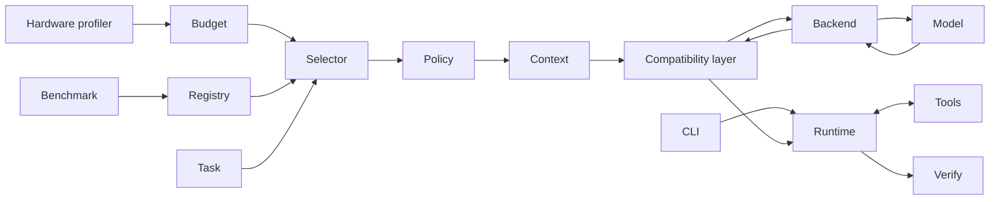
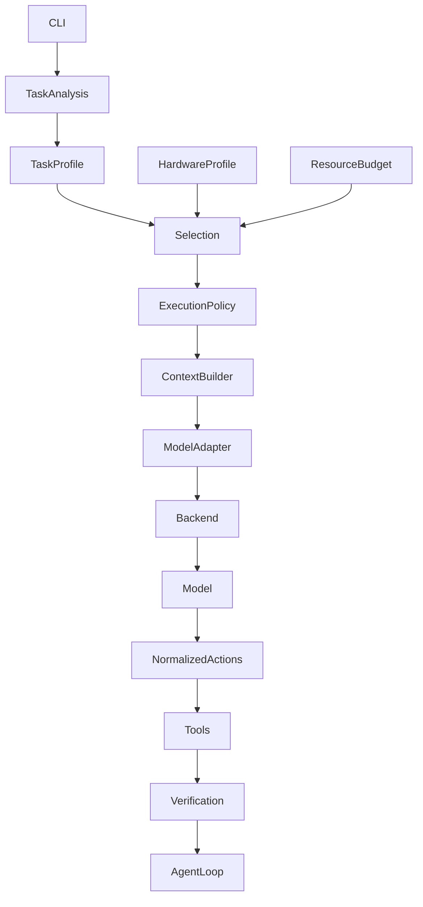
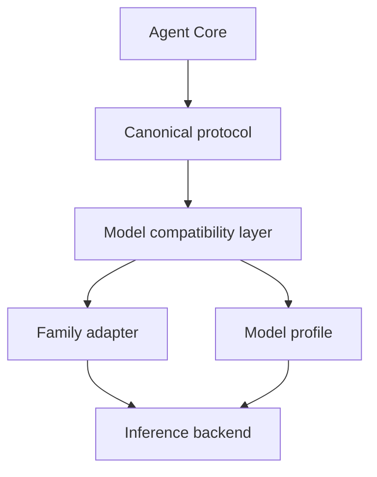
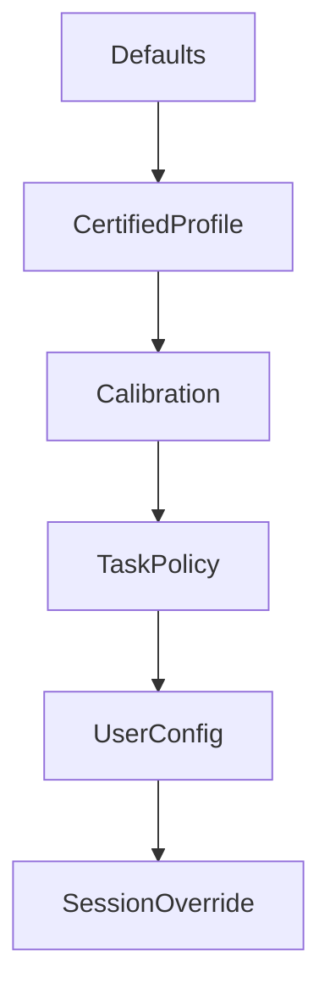
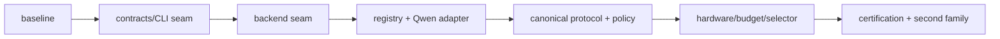

> **Historical record, superseded as current design on 2026-09-12.** The body is kept as evidence of the design it records; it is **not** a description of the current system. Since then, among other changes: Ollama and LM Studio were removed (2026-09-19) and PWR runs models on its own MLX engine, with llama.cpp in progress; the conversation became the product loop; the desktop app is Tauri 2 + Angular; conversations run in an Ask or Auto permission mode. **For the current state read** the [README](../../README.md) (status), the roadmap's latest update ([`roadmap.md`](../roadmap.md)), the backlog's *At a glance* ([`backlog.md`](../backlog.md)), [`current-cli.md`](../current-cli.md), [`pwr-serve.md`](../pwr-serve.md) and [SECURITY.md](../../SECURITY.md).

# Target architecture

## Boundaries

`AgentRuntime` owns the state machine but consumes only `CanonicalRequest`,
`NormalizedResponse`, `ExecutionPolicy`, `ContextPackage`, `ToolDefinition`
and verification outcomes. It may not import family names, backend wire DTOs,
hardware commands or profile files.

| Component | Responsibility / input / output | Allowed; forbidden |
|---|---|---|
| HardwareProfiler | machine facts -> `HardwareProfile` | OS probes; no selection policy |
| ResourceBudgeter | facts + runtime availability -> budget | profiles; no backend HTTP |
| Backend | discovery/generation/metrics -> normalized transport | wire DTOs; no agent policy |
| Registry | declared, discovered, measured model records | storage; no direct execution |
| Compatibility layer | canonical request <-> wire request/response | profiles/backend capabilities; no tools execution |
| Task profiler | task/repository facts -> task requirements | repository index; no model name |
| Selector | candidates + budgets + task -> selection | registry/evidence; no prompt strings |
| Policy resolver | selection + task -> immutable policy | capability contract; no CLI |
| Context engine | policy/repository/history -> package | retrieval/store; no backend template |
| Tool/verification engines | execute and prove outcomes | canonical actions; no model parsing |
| Benchmark/calibration | produce evidence, never runtime policy directly | backend/runtime; no mutable model claims |

Lifecycle: startup discovers hardware/backends/models; task start snapshots
availability and freezes selection/policy; every turn adapts, executes and
verifies; benchmark/calibration writes versioned evidence for later tasks.

