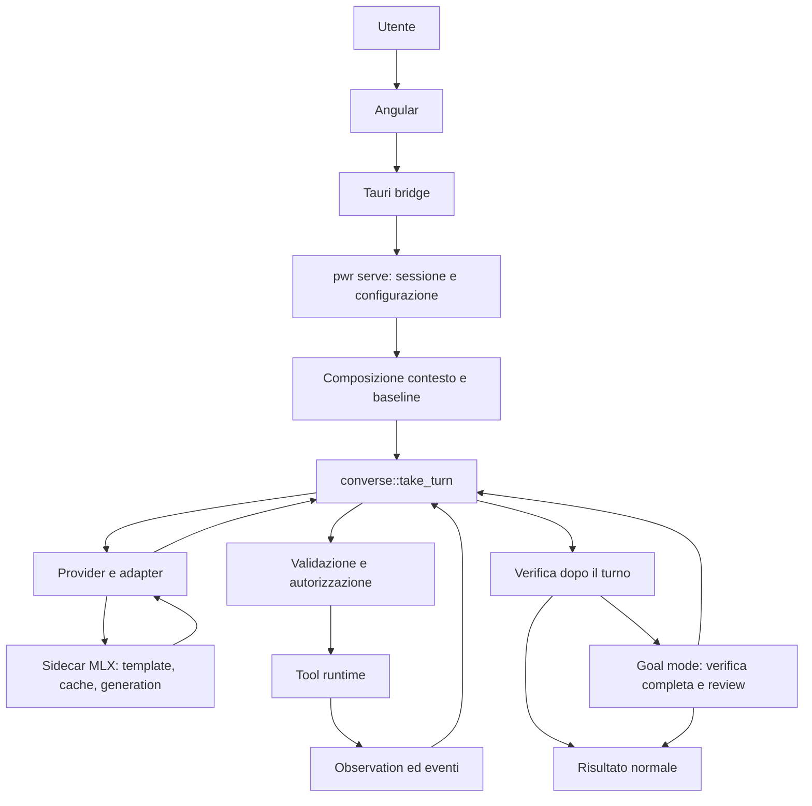

# Technical review, 2026-09-30 (as delivered)

> Recorded verbatim, in the language it was delivered in (Italian), so the plan
> built on it can always be checked against what it actually said. The review
> was made against commit `efdd2798`. Every claim was re-checked against
> `develop` at `0776ff4f` before anything was planned: the verdicts, the two
> corrections and the problems the review missed are in
> [2026-09-30-verification.md](2026-09-30-verification.md). What follows from
> it is in the [implementation plan](../plan/implementation-plan.md).
> Line numbers below are the reviewer's, at `efdd2798`; the verification gives
> the current ones.

---

# Verdetto

**PWR contiene un runtime locale sostanziale, ma non ha ancora dimostrato il vantaggio tecnico che giustificherebbe la sua complessità attuale.**

Il valore più concreto è nell'integrazione fra inference locale, strumenti controllati, modifiche ispezionabili e feedback dei verificatori. Il valore meno dimostrato è nell'"intelligenza" adattiva dell'harness: capability probing, gestione avanzata dello stato, knowledge graph e recovery non costituiscono automaticamente un miglioramento dell'agente.

La mia decisione sarebbe:

| Decisione | Verdetto |
|---|---|
| Investire altri 12 mesi | **Solo subordinatamente a una prova comparativa del core.** Non approverei un investimento indistinto nella roadmap attuale. |
| Usarlo ogni giorno | **Come agente supervisionato per task circoscritti**, su repository recuperabili. Non ancora come esecutore autonomo affidabile. |
| Mantenerlo come open source serio | **Sì, restringendo superficie e promesse**, e pubblicando evidenze riproducibili. |
| Presentarlo a engineer esperti | **Sì come sistema sperimentale con risultati e limiti espliciti.** Non come harness già competitivo. |
| Evolverlo in prodotto | **Possibile nella nicchia Apple Silicon/local-first**, ma il posizionamento deve diventare molto più preciso. |

La domanda decisiva è questa:

> **A parità di modello, macchina e budget, PWR risolve più task reali di un loop semplice, oppure raggiunge gli stessi risultati con meno tempo e meno interventi umani?**

Oggi il repository permette di investigare questa domanda. Non permette ancora di rispondere affermativamente con sufficiente forza.

---

# 1. Perimetro, metodo ed evidenze

Ho esaminato il checkout Git in `/Users/vitosantanelli/Desktop/PWR/PWR`, al commit **`efdd2798` del 30 settembre 2026**. La directory superiore contiene anche `PWR_web`, con due progetti di sito separati: non sono il frontend dell'agente.

La review ha seguito i percorsi produttivi e i principali moduli dei 15 crate Rust, il desktop Angular/Tauri, il sidecar MLX, test, configurazioni, strumenti, documentazione corrente e storica, workflow, distribuzione e apparati di evaluation. Non è una certificazione di ogni riga né un penetration test completo.

**Nessun codice modificato. Working tree pulito al termine.**

Verifiche eseguite:

| Verifica | Risultato |
|---|---|
| `cargo test --workspace --no-fail-fast --quiet` | **Exit 101: un test fallito**, relativo all'accesso al daemon Docker |
| Desktop `npm test -- --watch=false` | **94 test passati**, 12 file |
| Sidecar Python `unittest discover` | **37 test passati** |

Il test Rust fallito è `docker_reaches_its_daemon_only_when_the_engine_is_granted`, in `crates/pwr-tools/tests/sandbox_and_approvals.rs:1516`. Dopo il grant, Docker restituisce comunque "Cannot connect to the Docker daemon".

**Fatto:** la suite non è verde su questa macchina.
**Inferenza:** il test confonde l'esistenza del socket con la disponibilità effettiva del daemon, oppure incontra un problema nell'adapter. Il risultato da solo non distingue le due cause e non dimostra un'evasione del sandbox.

Non ho eseguito campagne nuove con modelli, build DMG, walkthrough grafici o benchmark hardware. I risultati sperimentali citati sotto provengono dai report esistenti; non li presento come misure riprodotte durante questa review.

Nel seguito:

- **Fatto:** comportamento leggibile nel codice o risultato osservato.
- **Inferenza:** conseguenza tecnica plausibile, senza riproduzione completa.
- **Ipotesi:** tesi da misurare.
- **Raccomandazione:** scelta proposta.

---

# 2. Architettura reale

PWR oggi è soprattutto **un'app desktop Mac che governa un agente locale tramite un processo Rust**, con inference MLX in un processo Python. Non è un sistema distribuito; la concorrenza rilevante riguarda processi, stream, sessioni e ownership delle risorse locali.

| Componente | Responsabilità effettiva |
|---|---|
| `apps/desktop` | Conversazione, modelli, permessi, diff, workbench, metriche |
| Tauri | Avvio/stop del core, bridge JSON, eventi, terminale, installazione engine |
| `pwr-cli` | Composizione del sistema, configurazione, protocollo, sessioni, Goal mode, parti sostanziali della verifica |
| `pwr-orchestrator` | Loop scripted e conversazionale, stato, contesto, compattazione, strumenti, memoria/wiki |
| `pwr-provider` | Contratti generation/backend, stream, cancellation, metriche |
| `pwr-runtime` | Selezione e delega MLX/llama, osservazione host/hardware |
| `pwr-mlx` | Processo engine, protocollo, adapter, inspection, embedding |
| Sidecar `pwr_mlx.py` | Template, tokenizer, pesi, KV/prompt cache, prefill, sampling, reasoning |
| `pwr-llama` | GGUF, processo `llama-server`, API locale e streaming |
| `pwr-compat` | Normalizzazione delle convenzioni delle famiglie |
| `pwr-models` | Hub, download, fit, profili, sampling, calibrazione |
| `pwr-repo` | Inventory incrementale, simboli/import superficiali, retrieval |
| `pwr-tools` | Policy, filesystem, processi, servizi, fetch, documenti, screenshot |
| `pwr-verify` | Discovery dei check, esecuzione, confronto baseline, classificazione/recovery |
| `pwr-store` / `pwr-observe` | Eventi SQLite, catene hash, replay, diagnosis |
| `pwr-eval` | Corpus, outcome, condizioni, confronti e accounting |

Il percorso produttivo principale è:

**Lo scostamento principale dallo schema richiesto è la verifica.**

Nel turno normale, `converse::take_turn` restituisce il risultato; la verifica successiva è eseguita dal chiamante in `main.rs:4820`. Se i check falliscono, l'app aggiunge il verdetto alla risposta e alla history, ma quel turno è già terminato.

Goal mode aggiunge un ciclo esterno in `serve.rs:1932`.

Il runner scripted ha invece verifica e recovery dentro `run_action_loop_with_prompt_budget_and_context_tiers`, in `lib.rs:2936`.

**PWR possiede quindi più semantiche di esecuzione, non soltanto più interfacce.**

---

# 3. Architecture review: i problemi che precedono qualsiasi espansione

## 3.1 Il livello CLI possiede troppo comportamento di prodotto

**Fatto:** `main.rs` contiene circa 13.200 righe; `serve.rs` circa 6.100; l'orchestrator principale circa 8.700; `take_turn_inner` occupa una parte enorme di `converse.rs`. Questi conteggi includono test incorporati e commenti: non sono tutti codice produttivo.

Il problema non è il conteggio. È che configurazione, composizione del contesto, verification policy, sessioni, model lifecycle e comportamento Goal sono distribuiti fra orchestrator e CLI.

**Inferenza:** introdurre una nuova interfaccia o un nuovo benchmark richiede ricostruire implicitamente lo stesso prodotto.

**Raccomandazione:** un unico esecutore di sessione che restituisca risultati strutturati. CLI e desktop devono scegliere presentazione e interazione, non semantica di accettazione.

## 3.2 Esistono due loop con differenze sostanziali

Shared tools e shared provider non equivalgono a shared runtime.

Planning, completion, compaction, recovery e catalogo differiscono. Lo ammette anche il README, ma il rischio resta architetturale.

**Raccomandazione:** mantenere B0/B2 come controlli sperimentali; convergere il prodotto e il trattamento PWR su un solo percorso esecutivo.

## 3.3 I confini delle dipendenze non seguono sempre la responsabilità

**Fatto:** `pwr-models/Cargo.toml` dipende dall'orchestrator per il calcolo della finestra.

Un componente di catalogo/download/fit dipende quindi da un crate che possiede agent loop, wiki e sessioni.

**Raccomandazione:** spostare solo la matematica di risorse e finestra in un modulo piccolo e neutrale. Non creare un altro framework: correggere la dipendenza concreta.

## 3.4 L'architettura accumula stato senza una gerarchia abbastanza netta

Event log, checkpoint, snapshot dei messaggi, ledger, wiki, graph, summary, registry progetti, cache embedding e repository index hanno significati diversi, ma descrivono porzioni sovrapposte della stessa sessione/workspace.

Una proiezione ricostruibile non è un errore. L'errore è non rendere immediato quale stato:

- decide il comportamento;
- costituisce evidenza;
- è soltanto cache;
- può essere eliminato e ricostruito.

**Raccomandazione:** una sessione autorevole, artefatti verificabili, proiezioni esplicitamente disposable. Nessuna nuova forma di memoria prima di chiarire questa ownership.

---

# 4. Agentic loop: utile, ma ancora fragile

Ci sono scelte corrette:

- tool call strutturate nella history;
- risultati associati ai call ID;
- refusal feedback concreto;
- budget per azioni;
- rilevamento di ripetizioni;
- cancellation dei comandi;
- rifiuto di `complete` dietro altre azioni della stessa risposta.

Quest'ultimo controllo in `converse.rs:1730` risolve un problema reale: il modello non può dichiarare concluso il lavoro senza avere letto l'esito delle scritture precedenti.

Ma restano difetti importanti.

### P1 — Il limite globale di Goal mode non è realmente globale

**Fatto:** `GOAL_MAX_ACTIONS = 208`. Il controllo compare nell'`else if` successivo al ramo `if report.completed`, in `serve.rs:2028` e `serve.rs:2184`.

**Inferenza:** una sequenza di completion respinte con failure set alternati può continuare oltre il limite. Il contatore "stessa failure tre volte" non risolve il caso alternato.

Non ho riprodotto questa sequenza con un modello. La lacuna nel controllo è visibile nel flusso.

**Raccomandazione:** controllare budget globale prima di ogni nuova iterazione, includendo verification, review e generation. Aggiungere un limite wall-clock indipendente.

### P1 — La compattazione perde requisiti per costruzione

**Fatto:** la prima richiesta conservata è limitata a **800 caratteri**, le richieste successive sono ridotte a righe di **200 caratteri**, con un massimo di 12 richieste. Vedi `compaction.rs:43`.

Questo è un sommario deterministico, ma **deterministico non significa fedele**.

Una specifica lunga con vincoli alla fine può perdere precisamente ciò che decide il successo.

**Raccomandazione:** separare objective e revisioni dalla conversazione comprimibile. Se non entrano nel budget, dichiarare il problema; non convertirle silenziosamente in una descrizione abbreviata.

### P2 — Molti detector, nessun unico budget di recovery

`silent`, malformed calls, backend faults, reasoning unfinished, runaway output, refused streak, echoes, failed commands, context drops e stall hanno limiti separati.

Ogni meccanismo ha una motivazione. La loro composizione crea però molte traiettorie difficili da prevedere.

**Raccomandazione:** preservare le classificazioni, ma spendere un budget condiviso di recovery, con contatori per causa e costo totale.

---

# 5. Reality check sui modelli piccoli

**PWR aiuta soprattutto quando toglie al modello lavoro meccanico. Aiuta molto meno quando gli chiede di coordinare un sistema più sofisticato.**

| Classe | Supporto utile | Rischio principale |
|---|---|---|
| 7B–9B | Azioni piccole, pochi tool pertinenti, editing preciso, errori localizzati | Richiedere planning, lunghe specifiche, autonomia e autoreview già affidabili |
| 14B | Buon target per repair circoscritti e cicli check/fix | Degrado su task lunghi, tool ambiguity e context pollution |
| ~30B | Task più articolati plausibili; caching e riduzione dei turni acquistano valore | Latency/prefill e costo di reasoning ripetuto |
| 70B quantizzati | Potenzialmente più capaci su host adeguati | Memoria totale, cache, tempi interattivi e compatibilità non dimostrata |

Questa è una valutazione progettuale, **non una classifica empirica dei modelli**. Parameter count non sostituisce famiglia, training, template, quantizzazione e task.

Per dare un ordine di grandezza puramente aritmetico: 70 miliardi di parametri a 4 bit valgono circa **35 GB di soli pesi ideali**, prima di overhead e cache. "Consumer hardware" non può significare indistintamente qualsiasi Mac.

Aiutano un modello debole:

- diagnosticare automaticamente il punto file/riga;
- restituire hash e risultati chiari;
- evitare output inutilmente grandi;
- indicare un path alternativo concreto;
- distinguere errore ambientale da errore di codice.

Richiedono già capacità elevate:

- scegliere fra molti tool simili;
- mantenere un piano con dipendenze;
- usare correttamente un knowledge graph;
- autoverificare una specifica lunga;
- cambiare strategia dopo feedback generico;
- integrare summary non verificati.

**Raccomandazione:** trattare 7B–14B come target esplicito, con task e budget adeguati. Non usare successo con un ~35B come evidenza che l'harness compensi un 9B.

---

# 6. Model-aware: reale nella compatibilità, incompleto nella strategia

PWR è model-aware in senso operativo:

- adapter di famiglia;
- template e tokenizer;
- sampling;
- reasoning control;
- provenienza;
- memoria/context fit;
- stato Provisional/Limited/Locally calibrated;
- invalidazione delle evidenze.

Questo è codice utile, soprattutto in `pwr-compat`, `profile.rs` e `reasoning.rs`.

Non ho trovato una prova equivalente che PWR scelga **una strategia agentica migliore per quel deployment su task nuovi**.

Quick Calibration fa al massimo nove richieste, con fixture, tool selection, arguments e continuation. Il suo stesso codice precisa che non misura coding competence né long context: `calibration.rs:1`.

**Verdetto:** utile come smoke test di compatibilità; insufficiente come predittore di affidabilità.

La combinazione migliore oggi è:

1. profilo statico per fatti noti di famiglia/template;
2. probe breve per verificare che l'installazione funzioni;
3. behavioral evaluation per attestare capacità su task;
4. adattamento runtime soltanto quando una misura predice una decisione utile.

Il registry `verified-models.json` è vuoto. È onesto. Significa anche che la certificazione generale dei modelli non è una capability già consegnata.

---

# 7. Context engineering: più di concatenazione, meno di un vantaggio dimostrato

Ci sono basi valide:

- inventory persistente e incrementale;
- esclusione di directory interne;
- hashing;
- sezioni del prompt tipizzate;
- priorità di eviction;
- bounded excerpts;
- strutture native per tool call/result;
- compattazione meccanica;
- metriche di composition.

Il retrieval di `pwr-repo` resta prevalentemente lessicale:

- simboli estratti superficialmente;
- pesi per simboli/path/termini;
- finestre attorno ai match;
- sezioni Markdown;
- ranking semantico opzionale.

Non è repository understanding semantico completo. Il graph usa anche risoluzioni per path e convenzioni di naming: le etichette di certezza sono appropriate, ma il nome della feature può suggerire più comprensione di quella disponibile.

Problemi concreti:

- **Tokenizzazione stimata:** `text.len()/4` misura byte, non token reali.
- **Required sections senza rifiuto esplicito:** `context::compile` può mantenere un prefisso obbligatorio oltre il budget; `context.rs:526`.
- **Stime multiple:** il conversazionale usa anche una stima conservativa a `/3`; non esiste un'unica contabilità esatta preflight.
- **Cache mtime+size:** utile per velocità, non prova di freschezza del contenuto.
- **Documenti grandi:** l'indicizzatore legge il file prima di applicare `MAX_INDEXED_BYTES`; il bound non protegge quella lettura.
- **Errori di retrieval degradati a vuoto:** il fallback è ragionevole, ma deve essere osservabile.
- **Compaction e retrieval possono contendersi la cache:** aggiungere contesto migliore può aumentare il prefill.

La guidance Angular in `context.rs:339` contiene persino "no tool renders or screenshots it", mentre `look_at` esiste per deployment vision.

**Fatto:** un'assunzione di capability è hardcoded in guidance di framework.
**Raccomandazione:** derivarla dal catalogo effettivo, oppure eliminarla.

**Risposta alla domanda centrale:** PWR fa più che inserire informazioni nel prompt. Ma non ha ancora dimostrato che il suo sistema di contesto batta una baseline semplice di richiesta fissata, history recente e file letti su richiesta.

---

# 8. Tool system e sicurezza

Le parti migliori sono:

- execution con argv;
- ambiente ripulito;
- scratch/HOME nel workspace;
- Seatbelt applicato ai processi;
- rifiuto quando il sandbox non è disponibile;
- output bounded;
- process group supervisionati;
- hash per editing;
- controlli su symlink;
- eventi anche per azioni negate.

Sono proprietà concrete, non cosmetiche.

**Non lo considererei però pronto per autonomia generale.**

### P1 — Le protezioni non sono equivalenti fra editing e comandi

**Fatto:** `refuse_if_protected` verifica i path protetti per i tool filesystem. Il profilo Seatbelt vieta scritture a `.pwr` e hook Git, ma non incorpora i path arbitrari di `self.protected`; `lib.rs:1984`, `lib.rs:2253`.

La stessa asimmetria interessa manifest e dependency tree: l'approvazione è riconosciuta nei tool e in alcune forme di comando, ma il processo può scrivere nel workspace.

**Inferenza forte:** un interprete o script autorizzato può modificare un file che il tool di editing rifiuterebbe, senza una protezione OS equivalente.

Questo non è una shell injection. È un problema di **confine degli effetti**.

**Raccomandazione:** rendere le protezioni valide anche per processi e check. Se una restrizione non può essere imposta, non presentarla come garantita.

### P1 — `own_overwrite` annulla il valore del prerequisito di lettura

In `converse.rs:2470`, `write_file` su file esistente diventa `ApplyReplace` e il core calcola da solo l'hash corrente.

**Fatto:** l'hash viene ottenuto al momento dell'esecuzione, non dalla versione conosciuta dal modello.

**Inferenza:** una riscrittura basata su contenuto vecchio può sovrascrivere una modifica umana recente e passare il controllo hash.

**Raccomandazione:** l'hash deve rappresentare la versione su cui l'agente ha ragionato. Non va "riparato" automaticamente dal core.

### P1 — Le scritture non sono atomiche

`apply_patch`, `replace_text` e altre operazioni usano `std::fs::write` dopo read/check; esempio in `lib.rs:3493`.

**Inferenza:** crash/errori possono lasciare contenuto parziale; una modifica concorrente può avvenire fra hash check e write. Canonicalizzazione prima dell'accesso non elimina tutte le race sui path.

**Raccomandazione:** staging e sostituzione atomica, controllo del conflitto il più vicino possibile al commit, rifiuto di ambiguità. Non promettere rollback generale.

### Limiti ulteriori

- Docker socket conferisce autorità del daemon oltre il sandbox.
- LocalService non è isolamento loopback rigoroso.
- Network grant ampio non equivale a egress per destinazione.
- Argv non impedisce codice arbitrario in Python, Node, build script o package lifecycle.
- Il parser PDF interno decomprime con `read_to_end` senza bound sull'espansione: `document.rs:232`.

Il documento `SECURITY.md` è utile perché ammette diversi di questi limiti. Le promesse dell'interfaccia devono rispettarli altrettanto chiaramente.

---

# 9. Deterministic verification: il nucleo migliore, con un contratto incompleto

PWR distingue correttamente alcuni concetti che molti agenti confondono:

| Meccanismo | Cosa dimostra |
|---|---|
| Compiler/build/typecheck | Proprietà verificate da quel tool |
| Test esistenti | Comportamento coperto dai test |
| Baseline prima/dopo | Alcune regressioni rispetto allo stato iniziale |
| Check web assets | Esistenza/coerenza di alcuni riferimenti |
| Diff/hash | Effetti sul filesystem |
| Review dello stesso modello | Un'ulteriore opinione, non verifica indipendente |

La discovery `.pwr/checks.json → CI → manifest/marker` è pragmatica. Tuttavia il parsing CI è euristico: `split_whitespace`, nessuna semantica completa di cwd, env o script multilinea. Vedi `pwr-verify/lib.rs:438`.

**Raccomandazione:** CI discovery deve proporre check, non conferire falsa precisione a una ricostruzione incompleta. Il contratto esplicito deve restare il percorso forte.

### Il problema più serio: congelare il comando non congela il verificatore

Goal mode confronta l'hash di `.pwr/checks.json`; `serve.rs:723`.

**Fatto:** questo non congela automaticamente test, script e configurazioni che il comando esegue. Le protezioni aggiuntive dipendono da `.pwr/protected.json`.

**Inferenza:** "goal verified" può certificare check passati dopo che il loro significato è stato indebolito.

La stack matrix affronta meglio questo problema restaurando i test del proprietario nella copia di verifica: `runner/run.py:143`.

**Raccomandazione:** il contratto deve includere gli artefatti che decidono l'accettazione e le eccezioni autorizzate alle loro modifiche.

### Completion non verificata

Il runner scripted oggi permette `TaskComplete { verified: false }` quando non ci sono verificatori utilizzabili; `orchestrator/lib.rs:3733`.

È una distinzione sensata fra consegna e verifica. Ma contraddice passaggi storici della documentazione secondo cui l'assenza di verifier impedisce completion.

**Raccomandazione:** un solo risultato strutturato con stati distinti: consegnato, check passati, baseline preservata, accettato, non verificabile, fallito.

**Verdetto:** deterministic verification può ridurre molto la falsa accettazione. Non può trasformare test insufficienti in una specifica completa.

---

# 10. Recovery: più di un retry wrapper, meno di un solver

Nel percorso scripted c'è recovery reale:

- riproduzione del check;
- classificazione;
- feedback diagnostico;
- budget edit/verify;
- context tier retry;
- stop per ambiente/policy/nondeterminismo.

In `pwr-verify/lib.rs:1002`, però, la riproduzione distingue nondeterminismo confrontando **exit code**, non la failure semantica. Due fallimenti diversi con exit 1 restano indistinguibili.

La classificazione usa pattern nei log. È un'euristica utile, non una tassonomia deterministica dei problemi reali.

Nel prodotto conversazionale il recovery ha soprattutto la forma di:

- istruzioni correttive;
- retry bounded;
- nuove generation;
- continuation di Goal mode.

Non vedo un meccanismo generale che dimostri un cambio di strategia appropriato.

**Raccomandazione:** mantenere recovery specifico per effetti ben definiti — stale hash, malformed call, processo fallito, contesto esaurito — e fermarsi quando manca evidenza. Non aggiungere "strategia adattiva" generica.

Il confronto di Goal mode basato sui soli nomi dei check può anche fermare un agente che sta facendo progressi dentro la stessa suite: il comando resta identico, cambiano i test falliti.

---

# 11. Backend e inference

## MLX

È la parte più distintiva implementata.

Il sidecar possiede davvero:

- load dei pesi;
- tokenizer/template;
- reasoning phase;
- sampling;
- prompt/KV cache;
- riuso del prefisso;
- trattamento diverso delle cache trimmabili;
- prefill a chunk;
- metriche;
- isolamento della cache degli `aside`.

Vedi `pwr_mlx.py:617`.

Questa complessità è in buona parte giustificata: corregge differenze reali di template e cache. **Non riscriverei queste parti per renderle artificialmente backend-neutral.**

Problemi:

- cancellation controllata durante generation, ma non nel ciclo manuale `prefill`;
- il mutex del sidecar viaggia con lo stream: serializzazione corretta, ma una generation lenta blocca le altre;
- i summary idle possono impegnare l'unico engine quando arriva un utente;
- `prepare_context` registra la scelta e restituisce il numero richiesto; non verifica che tutta la richiesta tokenizzata entri: `pwr-mlx/lib.rs:1474`.

**Inferenza:** Stop può chiudere la percezione del turno prima che il motore abbia davvero liberato la risorsa durante un lungo prefill.

## llama.cpp

Esiste un adapter concreto, non soltanto un placeholder: GGUF inspection, server gestito, streaming e test. Ma il percorso resta sperimentale.

In `pwr-llama/lib.rs:134`, `tool_choice = required` quando ci sono tool impone una semantica diversa dalla conversazione MLX, che può rispondere in prosa.

**Raccomandazione:** separare "supporto del protocollo" e "comportamento del turno". Non attribuire automaticamente constrained calling affidabile a qualsiasi versione/template di `llama-server`.

La separazione `ModelProvider`/`InferenceBackend` è ragionevole. Il `BTreeMap<String, Value>` dei parametri è invece un punto di leakage: facilita l'estensione ma consente opzioni ignorate o interpretate diversamente.

---

# 12. Performance e hardware consumer

I colli di bottiglia più importanti sono probabilmente:

1. generation e reasoning;
2. prefill e cache miss;
3. check/build;
4. caricamento modello;
5. scanning/retrieval su workspace grandi.

IPC e SQLite non sono la prima priorità senza misure.

Problemi visibili:

- `walk_with_cache` legge integralmente prima del size bound;
- `IndexCache::retain` usa ricerca lineare nella lista dei presenti;
- ricostruzione wiki/graph dopo i turni;
- snapshot completi della conversazione nell'event log;
- cache embedding senza evidente eviction;
- molte operazioni filesystem/SQLite sincrone nei percorsi async;
- `Embedder::read_line` è bloccante e senza timeout: `embed.rs:138`.

Quest'ultimo è un failure mode reale dell'architettura: "fallback al lessicale se fallisce" non protegge da un processo che non risponde mai.

La finestra hardware-aware considera pesi, KV e transient. Bene. Ma usa memoria totale meno una riserva euristica, non una garanzia sulla disponibilità durante la sessione.

**Raccomandazione:** distinguere:

- finestra teoricamente allocabile;
- finestra empiricamente stabile;
- finestra efficace per il task;
- finestra economicamente interattiva.

Massimizzare la prima non massimizza le altre.

---

# 13. Frontend e UX

Il frontend ha un confine native/core abbastanza pulito: `bridge.ts`. Markdown sanitizzato e CSP sono scelte concrete corrette.

Diff, permessi, stato delle azioni e possibilità di interrompere aumentano la produttività perché rendono il lavoro controllabile.

Il rischio è che l'app diventi **un cockpit dell'harness**.

Il developer dovrebbe vedere subito:

- cosa sta facendo;
- quali file ha cambiato;
- cosa resta da fare;
- quali check sono passati;
- perché si è fermato;
- quale decisione serve.

Dettagli su token accounting, certification confidence, composition, backend diagnostics e graph devono essere secondari.

### Da nascondere o spostare in Advanced

- graph 3D;
- stream di reasoning come principale indicatore di lavoro;
- parametri interni di compaction;
- diagnostica di calibrazione;
- metriche non actionable.

Il graph 3D in `knowledge.ts` introduce dipendenze e rendering specifici senza evidenza che riduca il tempo per completare task.

**Raccomandazione:** outline interrogabile e navigazione file/simboli prima di una visualizzazione tridimensionale.

Un'altra incoerenza UX: la verifica post-turno emette una nota prefissata `✓` anche quando il testo descrive un fallimento. Il simbolo deve dipendere dal risultato, non dall'avvenuta esecuzione della verifica.

Non ho effettuato un walkthrough grafico: queste conclusioni derivano da componenti, stato e template.

---

# 14. Feature audit

| Classe | Feature | Perché |
|---|---|---|
| **KEEP** | MLX locale con lifecycle gestito | Riduce setup e mismatch operativi |
| **KEEP** | Editing preciso, hash, diff e revert con conflitto | Rende gli effetti ispezionabili e recuperabili |
| **KEEP** | Check del repository e baseline | Feedback indipendente dal modello |
| **KEEP** | Streaming, Stop, steering | Essenziali quando inference richiede tempo |
| **KEEP** | Search/read windowed e dependency source read | Forniscono evidenza pertinente |
| **IMPROVE** | Sandbox e approval | Confini degli effetti ancora asimmetrici |
| **IMPROVE** | Contratto di accettazione | Deve includere ciò che il comando esegue |
| **IMPROVE** | Persistence/resume | Utile, ma deve gestire crash e effetti ambigui |
| **IMPROVE** | Model Manager e fit | Deve separare memoria, compatibilità e capacità |
| **SIMPLIFY** | Budget/recovery | Troppi contatori indipendenti |
| **SIMPLIFY** | Certification/selection domain | Superficie superiore alle evidenze disponibili |
| **SIMPLIFY** | Wiki | Inventory e note verificate bastano inizialmente |
| **MERGE** | Scripted e product execution | Una semantica produttiva, controlli sperimentali separati |
| **MERGE** | Ledger/checkpoint/task state | Ownership unica, proiezioni ricostruibili |
| **REMOVE** | Graph 3D dal core prodotto | Valore quotidiano non dimostrato |
| **REMOVE** | Summary automatici come default | Occupano engine e producono testo non verificato |
| **EXPERIMENTAL** | Semantic retrieval | Recall migliorata non implica task uplift |
| **EXPERIMENTAL** | `look_at`/vision | Servono prove di repair UI, non screenshot riusciti |
| **EXPERIMENTAL** | Evidence-state compaction | Meccanismo promettente, beneficio non confermato |
| **EXPERIMENTAL** | Autoreview del modello | Stesso modello e failure correlati |
| **EXPERIMENTAL** | llama.cpp nel prodotto | Serve un percorso end-to-end verificato |
| **MISSING** | Token preflight esatto | Evita overflow prima di generation |
| **MISSING** | Budget globale tempo/token/recovery | Limita tutte le traiettorie |
| **MISSING** | Verifier artifacts congelati | Impedisce false acceptance da test alterati |
| **MISSING** | Benchmark comparativo sul runtime produttivo | Dimostra la tesi centrale |

---

# 15. Code quality, persistence e manutenzione

Il codice non appare privo di disciplina: tipizzazione Rust, test avversariali, commenti motivati e rifiuti espliciti sono diffusi.

Ma ci sono problemi strutturali.

### God functions e ownership dispersa

`take_turn_inner`, il runner scripted e `main.rs` intrecciano moltissime responsabilità. Non suggerisco di spezzarli per numero di righe: suggerisco di estrarre decisioni con un contratto reale — budget, acceptance, action execution, persisted state.

### Typing parziale

`ChatMessage.role` è una stringa; sampling e numerosi outcome sono JSON generico. Questo consente combinazioni invalide e controlli distribuiti.

**Raccomandazione:** tipizzare i pochi confini che decidono sicurezza e completion. Non trasformare ogni payload in una gerarchia di tipi.

### SQLite non è ancora un journal concorrente robusto

`Store::append` legge l'ultimo hash e poi inserisce, senza una transazione che serializzi l'operazione.

**Inferenza:** writer concorrenti possono produrre link incoerenti. Non serve che oggi il caso sia frequente perché il contratto sia fragile.

Non sono presenti configurazioni esplicite per WAL/busy timeout o indici dedicati alle query per run/event type.

**Raccomandazione:** transazione di append, schema migration verificata e indici minimi; misurare il resto.

### Hash chain: utile, ma non tamper-proof

Aiuta a rilevare alterazioni o corruzione rispetto alla catena conservata. Non impedisce a chi controlla il database di riscrivere la catena o rimuovere un suffisso senza un anchor esterno.

Non costruirei infrastruttura crittografica aggiuntiva per risolvere un requisito che il prodotto non ha. Chiamarla **log verificabile**, non garanzia forte di provenance ostile.

### Nessun grande backlog TODO nel percorso principale

La ricerca non ha mostrato una costellazione di `todo!()` produttivi. Il rischio è più insidioso: **feature implementate ma non validate, commenti storici e tipi che fanno apparire consolidata una capacità sperimentale**.

Non posso classificare codice come morto soltanto perché sembra speculativo. Selection/certification meritano un audit di raggiungibilità prima di ulteriori estensioni.

---

# 16. Testing strategy

La suite dimostra molti invarianti dell'harness:

- path policy;
- tool parsing;
- edit conflict;
- cancellation;
- compaction;
- completion;
- action budgets;
- corpus accounting;
- protocol/session behavior.

È valore reale.

Non dimostra automaticamente:

- uso affidabile dei tool da un 9B;
- mantenimento della specifica dopo molte compaction;
- capacità su repository nuovi;
- qualità di una UI generata;
- vantaggio della policy adattiva.

Il file `two_loops.rs` aggiunge fixture conversazionali importanti. La stack matrix esercita il protocollo del desktop: è un passo nella direzione giusta.

Tre debolezze:

1. **Test dipendenti dall'host che fanno `return` se manca una risorsa.** Il numero di pass può includere casi non esercitati.
2. **Test live ignorati:** correttamente separati, ma devono produrre un report di coverage esplicito.
3. **Nessun E2E desktop completo nella CI letta:** unit/build non coprono primo avvio, engine install, workspace change e shutdown dei processi.

`CONTRIBUTING.md` dice ancora che il desktop non è in CI e che gli altri test sono hermetic. `.github/workflows/ci.yml` e i test Docker/.NET/browser mostrano una realtà diversa.

**Raccomandazione:** correggere il significato di "passato": exercised, skipped, ignored e environment failure devono essere distinguibili.

---

# 17. Evaluation: apparato serio, prova centrale assente

PWR possiede più infrastruttura sperimentale di quanto suggerirebbe un'alpha:

- hidden verifier;
- reference solution;
- wrong implementation;
- controlli B0/B1/B2;
- provenienza;
- budget;
- trial manifest;
- strict pairing;
- classificazione dei failure;
- contabilizzazione dei tentativi.

`compare_strict` è molto più credibile del comparatore legacy che accoppia soltanto modello/task/seed.

**Raccomandazione:** non mantenere il percorso permissivo come scelta normale per conclusioni causali.

## Cosa dicono davvero gli esperimenti esistenti

Il rerun R2 riporta:

| Deployment | B0 | B1 PWR | Interpretazione |
|---|---:|---:|---|
| `4420340fd319` | 11/30 | 11/30 | Nessun uplift osservato |
| `5df73e30dde5` | 13/30 | 18/30 | Segnale positivo, non conferma; sign test riportato `p=0,227` |

Sul primo deployment B1 consuma anche più generated tokens: 152.226 contro 106.034.

Il confronto post-freeze riporta meno token e meno minuti, ma meno hidden-check success: **14 contro 17**.

**Conclusione:** correggere malformed output e reasoning può migliorare il costo senza migliorare la capacità complessiva. Questo è precisamente il tipo di tradeoff da misurare, non da nascondere dietro "più robusto".

Il development run R3 riporta 2/35 risolti nel vecchio regime, con forte churn. Non è una misura del prodotto attuale e non è una conferma contro l'evidence-state treatment. È evidenza che il failure mode cercato esisteva.

## La stack matrix corregge un limite, ma introduce un altro estimand

`runner/run.py` usa il percorso produttivo, verifica una copia pulita e restaura i test.

Ma dopo una failure indipendente invia un nudge al modello: "il lavoro non soddisfa tutto ciò che ho chiesto".

**Fatto:** questo è feedback da un oracolo esterno, seppure senza rivelare il test.

**Raccomandazione:** riportare separatamente:

- successo autonomo al primo ciclo;
- successo con interventi generici;
- costo e numero degli interventi.

Non chiamare unattended completion il secondo.

## Riproducibilità pubblica insufficiente

Molti report e campagne sono ignorati da Git; `.gitignore` conserva decisioni di non pubblicazione.

I risultati sono accessibili al maintainer, ma non necessariamente a un reviewer esterno.

**Verdetto sulle metriche:** molte metriche sono serie, non vanity metrics. Diventano vanity quando vengono aggregate senza controllo di condizioni, interventi e copertura dei counter.

Manca ancora una conferma contemporanea sul **runtime produttivo attuale**, con modelli piccoli, task nuovi e baseline fissa.

---

# 18. Product review: perché dovrebbe esistere?

"Local models + tools + repo context + permissions" non basta.

Aider supporta già modelli locali e repository map; OpenCode espone un sistema di permessi. Queste proprietà non sono una differenziazione sufficiente. Vedi [Aider: modelli locali](https://aider.chat/docs/llms.html), [repository map](https://github.com/Aider-AI/aider/blob/main/aider/website/docs/repomap.md) e [OpenCode: permissions](https://opencode.ai/v2/docs/permissions).

Non sto suggerendo di copiarli. Sto dicendo che **quelle feature non giustificano da sole un altro prodotto**.

La posizione distinta plausibile è:

> Un agente locale per Apple Silicon che riduce gli errori operativi e il costo dei modelli medi, consegnando modifiche con evidenze chiare e preservando il lavoro dell'utente.

Il moat potenziale è una combinazione di:

- runtime MLX affidabile e interattivo;
- dati di failure su deployment reali;
- decisioni semplici validate da esperimenti;
- evaluation riproducibile;
- integrazione fluida fra diff, check e recovery.

Il moat non è:

- un graph 3D;
- una tassonomia ricca;
- una badge di calibrazione;
- una wrapper layer;
- una chat desktop gradevole.

La guida di Anthropic insiste su pattern semplici e valutazione del comportamento complessivo: è coerente con questa direzione, ma non prova che PWR la realizzi. [Building effective agents](https://www.anthropic.com/engineering/building-effective-agents?slug=helpful-honest-harmless-ai), [Demystifying evals](https://www.anthropic.com/engineering/demystifying-evals-for-ai-agents).

---

# 19. Challenge delle ipotesi A–G

| Ipotesi | A favore | Contro | Evidenza PWR | Misura necessaria | Conclusione |
|---|---|---|---|---|---|
| **A — Harness migliore compensa modello piccolo** | Elimina bookkeeping, errori di protocollo e ricerca meccanica | Non crea ragionamento o conoscenza mancanti | Fix operativi utili; uplift R2 misto | Stesso 9B/14B, baseline semplice, task nuovi, budget uguali | **Plausibile in ambiti circoscritti; non dimostrata generalmente** |
| **B — Local-first è un vantaggio sufficiente** | Privacy, offline, controllo, assenza di account inference | Setup, memoria, qualità e manutenzione trasferiti all'utente | Percorso MLX locale reale | Uso ripetuto, retention, tempo risparmiato e task abbandonati | **Segmento valido; non vantaggio universale** |
| **C — Model-aware migliora affidabilità** | Template, sampling e reasoning corretti evitano failure artificiali | Tuning per famiglia può overfittare | Adapter e reasoning control concreti | Policy fissa contro adattiva, holdout per task/deployment | **Compatibilità sì; strategia adattiva ancora esperimento** |
| **D — Hardware-aware importa all'utente** | Evita download/load impossibili e OOM | Troppe metriche; massima finestra può peggiorare UX | `fit`, `window`, host probes | OOM, pressure, first-token, p95 latency su classi di Mac | **Importante come automazione invisibile** |
| **E — Verification rende affidabile l'agente** | Riduce false completion e regressioni coperte | Test incompleti o modificabili non provano l'obiettivo | Baseline e acceptance esplicita | False acceptance con verificatori indipendenti | **Fondamentale, con garanzie limitate al contratto** |
| **F — Runtime probing supera profili statici** | Rileva installazioni/template rotti | Probe breve rumoroso; non predice task competence | Quick Calibration circoscritta | Valore predittivo della decisione, costo e invalidazione inclusi | **No evidenza di superiorità; usare combinazione minima** |
| **G — Un harness adatta modelli molto diversi** | Executor, policy e verification possono essere comuni | Tool format, reasoning, cache e capacità differiscono profondamente | Generic/family adapter e due engine | Trasferimento senza retuning su famiglie nuove | **Un executor comune sì; una policy universale no** |

La distinzione essenziale è fra **rimuovere un difetto dell'ambiente** e **aumentare la capacità del modello**. Entrambe le cose hanno valore. Soltanto la seconda sostiene la tesi adattiva forte.

---

# 20. Il minimum valuable core: il 30% da mantenere

Manterrei cinque elementi:

1. **Una sessione agentica unica e bounded**, con objective persistente, Stop e steering.
2. **Inference MLX gestita**, con template corretto, cache, cancellation e metriche necessarie.
3. **Pochi tool robusti:** search, read windowed, edit preciso, command, servizio locale.
4. **Diff e verification contract**, con baseline e protezione del lavoro umano.
5. **Evaluation dello stesso percorso**, con hidden acceptance e costi completi.

Questo core può rendere l'utente più produttivo anche se l'adattamento avanzato viene falsificato.

Le distrazioni principali sono:

- wiki e summary generalizzati;
- graph UI;
- espansione indiscriminata dei backend;
- certificazione prima delle campagne;
- general-purpose personal assistant;
- supporto a molte toolchain come obiettivo in sé;
- architettura di routing/decomposition non validata.

---

# 21. DO NOT BUILD

| Direzione | Perché non investirci ora |
|---|---|
| Multi-agent locale | Aggiunge context isolation, integrazione, conflitti e accounting prima di provare il singolo agente |
| Routing automatico dei modelli | Mancano predittori affidabili del deployment migliore per task |
| Knowledge graph 3D più ricco | Non risolve gli attuali failure di completion, sicurezza e contesto |
| Memoria semantica generalizzata | Introduce staleness e fatti non verificati |
| Critic/consensus con più chiamate | Può comprare costo e sicurezza percepita senza indipendenza |
| Browser/computer agent generale | Allarga drasticamente superficie e semantica degli effetti |
| Plugin/MCP marketplace | Nuovo trust boundary e manutenzione, senza bisogno dimostrato |
| Windows/Linux parity immediata | Prima serve un core stabile e una policy portabile definita |
| Nuovo PDF/OCR stack proprietario | Fuori dal core; il parser attuale già impone manutenzione specialistica |
| Ottimizzazione "massimo context" | Memoria disponibile non equivale a qualità o interattività |
| Sistema completo di certification | Badge senza evidenza sufficientemente ampia non è valore |
| Feature enterprise/audit avanzate | Il journal e i contratti basilari devono prima essere corretti |

---

# 22. BUILD NEXT

Quattro mosse, in quest'ordine.

### 1. Rendere sicuri e prevedibili gli effetti

Risolve: overwrite involontario, protezioni aggirabili dai comandi, scritture parziali, budget incompleti.

Include hash legato alla lettura, scrittura atomica, protection coerente e deadline globale.

### 2. Unificare esecuzione e risultato

Risolve: app, CLI ed evaluation che attribuiscono significati diversi a "complete".

Un executor produttivo, modalità conversazione/goal come policy, outcome strutturato.

### 3. Rendere il contesto un contratto controllabile

Risolve: requisiti persi, overflow e re-read churn.

Objective/revisioni conservati, token preflight sul template reale, log grandi recuperabili. Solo dopo confrontare recency fill contro evidence state.

### 4. Eseguire il benchmark decisivo

Risolve: investimento guidato da feature invece che da risultati.

Baseline semplice contro PWR attuale, 9B e 14B, task nuovi, stessa macchina/backend/quantizzazione, verificatori indipendenti e accounting completo.

---

# 23. Visione consigliata

> **PWR should be a dependable local coding agent for Apple-silicon developers, optimized for bounded repository changes with inspectable effects and independent checks. Its harness should remove mechanical work and execution errors from small and medium models, and retain adaptive mechanisms only when controlled evaluations show a practical benefit.**

| Campo | Definizione |
|---|---|
| **Core promise** | Modifiche locali controllabili, con esito e limiti della verifica chiari |
| **Target user** | Developer con Apple Silicon che valorizza privacy/offline e accetta capacità circoscritte |
| **Primary use case** | Diagnosis e repair di bug, piccole feature, refactor limitati in repository esistenti |
| **Technical differentiator** | Runtime locale interattivo più harness misurato per ridurre errori e costo |
| **Non-goals** | Autonomia generale, sostituzione dei frontier agent, distributed workers, personal assistant universale |
| **Success metric** | Task accettati indipendentemente per ora di utilizzo, con interventi umani e false acceptance riportati |

---

# 24. Roadmap

| Fase | Ordine pragmatico |
|---|---|
| **NOW** | Correggere overwrite, protection parity, scritture atomiche e Goal budget; preservare requisiti; rendere espliciti failure/skip nei test |
| **NOW** | Congelare verifier artifacts e distinguere consegna/check/acceptance; eliminare claim documentali incoerenti |
| **NEXT** | Unificare runtime produttivo; transazioni del journal e resume con effetti riconciliati |
| **NEXT** | Token preflight reale, cancellation nel prefill, timeout embedding, artefatti log recuperabili |
| **NEXT** | Campagna comparativa confermativa e pubblicazione dei risultati |
| **LATER** | Semantic retrieval ed evidence state solo se vincono sulle alternative semplici |
| **LATER** | Un percorso llama.cpp completo, poi eventuale secondo OS |
| **LATER** | Vision per task UI selezionati con acceptance browser indipendente |
| **NEVER / NOT NOW** | Multi-agent, routing automatico, graph 3D evoluto, marketplace, memoria universale, enterprise platform |

Distribuzione: Cargo/npm lock sono presenti, ma l'engine installa pin diretti senza un lock completo delle transitive; `uv` viene preso dal PATH e Python è specificato come `3.11`. Non è riproducibilità completa.

Il workflow release costruisce una draft prerelease, ma non incorpora tutti i gate di CI nella stessa job. **Raccomandazione:** legare test, dependency manifest e artefatto al medesimo commit prima di ampliare la distribuzione. Nonarizzazione e supply-chain inventory sono lavori di distribuzione concreti, non differenziazione AI.

---

# 25. I dieci rischi principali

Probabilità qualitative riferite all'uso previsto, non tassi misurati.

| # | Rischio | Probabilità | Impatto | Evidenza | Mitigazione |
|---|---|---|---|---|---|
| 1 | False acceptance | Alta | Critico | Hash del comando, test eseguiti non automaticamente congelati | Verifier artifacts protetti e scorer indipendente |
| 2 | Danno al lavoro umano | Media-alta | Critico | `own_overwrite`, read/check/write separati | Versione letta obbligatoria, commit atomico, conflitti |
| 3 | Policy asimmetrica | Alta quando si usano script | Critico | Protected path nei tool, assente equivalenza nel profilo processi | Protezione OS ed effetti riconciliati |
| 4 | Perdita della specifica | Alta su sessioni lunghe | Alto | Limiti 800/200 caratteri in compaction | Objective/revisioni fuori dalla history comprimibile |
| 5 | Loop costosi o stop errati | Media-alta | Alto | Goal guard per ramo; failure fingerprint grossolano | Budget globale e progresso basato su evidenze |
| 6 | Benchmark non rappresentativo | Alta | Critico per investimento | Scripted/product divergence; nudges esterni | Misurare runtime produttivo e interventi |
| 7 | Latency/pressure consumer | Alta su task lunghi | Alto | Prefill, copie cache, summary, finestre euristiche | Cache e cancellation misurate, envelope conservativo |
| 8 | Debito di manutenzione | Alta | Alto | Funzioni grandi, stato sovrapposto, molte toolchain/famiglie | Ridurre superficie e ownership unica |
| 9 | Differenziazione insufficiente | Alta | Critico per prodotto | Feature di base replicabili; uplift inconclusivo | Nicchia precisa e vantaggio misurato |
| 10 | Sostenibilità open source | Alta senza semplificazione | Alto | Engine/Rust/Angular/Tauri, evidenze private, documenti divergenti | Core piccolo, dati pubblici, onboarding e gate riproducibili |

---

# 26. Verdetto tecnico finale

## STRONGEST PARTS

1. Integrazione MLX, template e prompt cache.
2. Feedback concreto dei tool.
3. Verification con baseline e hidden evaluation.
4. Diff, cancellation e strumenti supervisionati.
5. Cultura sperimentale capace di conservare risultati negativi.

## WEAKEST PARTS

1. Divergenza fra runtime produttivo e scripted.
2. Confine delle protezioni fra tool e processi.
3. Overwrite che fabbrica l'hash corrente.
4. Compaction che abbrevia i requisiti.
5. Vantaggio adattivo ancora non confermato.

## MOST OVERENGINEERED

Graph 3D, summary automatici, superficie selection/certification, proliferazione di stato e detector indipendenti.

## MOST UNDERRATED

Dependency source search, diagnostic location, prompt-cache correctness, protezione delle modifiche umane, outcome espliciti.

## REMOVE FIRST

Graph 3D dal percorso principale e summary automatici come default. Deprecare il confronto evaluation permissivo.

## BUILD FIRST

Protezione coerente degli effetti, editing atomico con versione letta, budget globale e acceptance artifacts congelati.

## BIGGEST TECHNICAL BET

Togliere al modello lavoro meccanico abbastanza da compensare una parte misurabile dei suoi limiti.

## BIGGEST PRODUCT RISK

Spendere mesi a costruire un ambiente sofisticato che resta meno utile di un loop semplice con un modello adeguato.

## ONE THING THAT MUST BE PROVEN

**Sul runtime realmente usato dall'app, un 9B/14B con PWR deve battere una baseline semplice su task nuovi, a budget equivalenti, senza più false acceptance o interventi umani.**

Se non accade, va eliminata la complessità adattiva. Può restare un buon coding agent locale, ma deve smettere di investire come se la tesi più ambiziosa fosse già vera.
